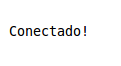

# ws-portabilidade-numerica-java

 Operadora encontrada!

 Teste Conexão JUnit!

 Teste Conexão JUnit!

###Objetivo
Esse projeto tem por finalidade, criar um serviço via JAVA, para que possa ser consumido em seu retorno as informações de um WebService(WS), para mostrar qual operadora de um determinado número de celular (claro, ctbc/algar telecom, nextel, oi, vivo, tim).  
Hoje com a portabilidade, não é possível mais ter certeza de qual operadora o número realmente é. 
Foi realizado também, cobertura de teste na conexão do  WebService.

###Pré-requisito para rodar o projeto			 
  -JDK 7 
  -Eclipse 
  -Repositório Maven
 
###Tecnologias utilizadas			 
  JAVA EE, XML, JSON, MAVEN, JERSEY (API WS), JUnit 4
		 
###Como executar?
Importar o projeto no eclipse.
Botão direito do mouse no Project Explore > Import > Maven > Existing Maven Project > caminho do download feito. 
Abrir a classe App.java e executar método main.  
Abrir a classe AppTest.java para efetuar o teste de conexão com um número de telefone válido.  
Let's be happy :D			 

			

